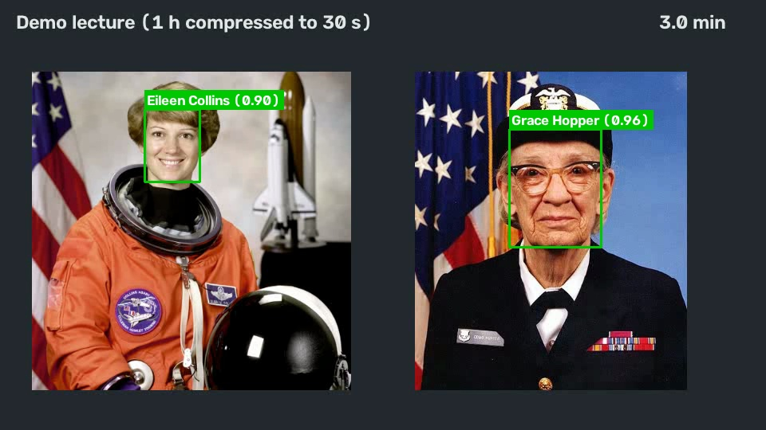
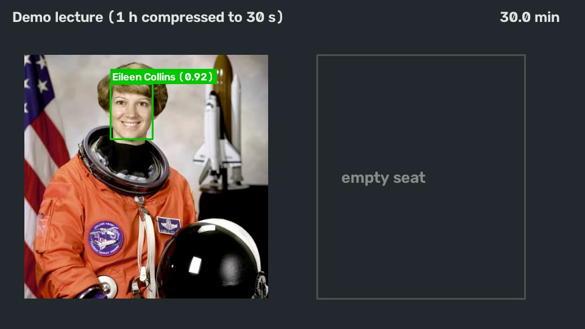
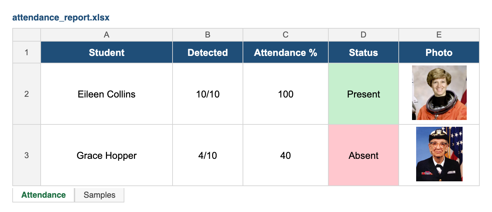
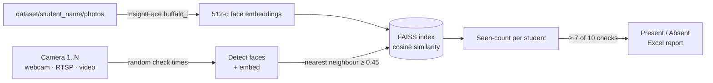

# 🌟 Smart Attendance System


👤 **Portfolio:** [khushal-narsaria.github.io](https://khushal-narsaria.github.io/)

Automatic classroom attendance using **face recognition**. Students are enrolled from a few photos each. During the lecture the camera(s) are checked at **random moments**, and a student is marked **Present** only if they are recognised in enough of those checks. Someone who shows up for five minutes and leaves is not marked present. The result is an **Excel report** with each student's photo.

<table>
  <tr>
    <td></td>
    <td></td>
  </tr>
  <tr>
    <td align="center"><sub>Check at ~3 min: both students recognised (cosine similarity in brackets)</sub></td>
    <td align="center"><sub>Check at ~30 min: Grace Hopper has left, so her seat is empty</sub></td>
  </tr>
</table>

<p align="center"></p>
<p align="center"><sub>Generated <code>attendance_report.xlsx</code>: seen in 4 of 10 checks means <b>Absent</b>.</sub></p>

## How it works



1. **Enrolment:** every photo in `dataset/<student name>/` is passed through InsightFace's **buffalo_l** model pack (SCRFD face detector + ArcFace ResNet-50 recogniser). The resulting 512-d embeddings are L2-normalised and stored in a **FAISS `IndexFlatIP`** (inner product on unit vectors = cosine similarity).
2. **Random sampling:** 10 check times are drawn at random across the lecture (1 hour by default). Students can't predict them, so they can't just be there for the roll call.
3. **Recognition:** at each check, a frame is read from every camera and each detected face is matched to its nearest enrolled embedding. A match needs a similarity above 0.45; anything else is "Unknown".
4. **Multi-camera fusion:** a student counts **once per check**, whichever camera saw them, so several cameras can cover a large room without double counting.
5. **Decision and report:** a student seen in **≥ 7 of 10** checks is Present, otherwise Absent. The report also has a *Samples* sheet listing who was recognised at each check.

## Run

```bash
python -m venv .venv && source .venv/bin/activate
pip install -r requirements.txt       # the buffalo_l model (~280 MB) downloads on first run
```

**Try the demo** (a 30-second video standing in for a 1-hour lecture):

```bash
python attendance_system.py --dataset demo/dataset --source demo/lecture.mp4 \
    --seed 7 --snapshots demo/output --report demo/attendance_report.xlsx
```

```
✅ Loaded 2 face embeddings for 2 students
🚀 Taking 10 random samples from the recording...
📸 Sample 1/10 (2.2 min): Eileen Collins, Grace Hopper
...
📸 Sample 4/10 (9.1 min): Eileen Collins, Grace Hopper
📸 Sample 5/10 (19.4 min): Eileen Collins
...
📊 Report saved: demo/attendance_report.xlsx
✅ Attendance process completed: 1/2 present
```

**Real classroom:** put a few clear photos of each student in `dataset/<Student_Name>/`, then:

```bash
python attendance_system.py                               # webcam 0, 1-hour lecture, 10 checks
python attendance_system.py --source 0 --source 1         # two cameras
python attendance_system.py --source http://PHONE_IP:4747/video  # phone camera via DroidCam
python attendance_system.py --duration 2700 --samples 12 --present 9
```

| Option | Default | Meaning |
| --- | --- | --- |
| `--dataset` | `dataset` | one sub-folder of photos per student |
| `--source` | `0` | camera index, RTSP/HTTP URL, video file, image or image folder (repeatable) |
| `--duration` | `3600` | lecture length in seconds |
| `--samples` | `10` | random checks during the lecture |
| `--present` | `7` | checks a student must appear in to be Present |
| `--threshold` | `0.45` | minimum cosine similarity for a match |
| `--report` | `attendance_report.xlsx` | output Excel file |
| `--snapshots` | – | folder to save annotated frames of every check |
| `--seed` | – | fixes the random check times (reproducible runs) |

Live cameras are checked in real time, spread across `--duration`. For recorded videos and image folders, the same random positions are read from the recording, so a run finishes in seconds. It uses the GPU (`onnxruntime-gpu`) when CUDA is available, and the CPU otherwise.

## Project structure

```
attendance_system.py       the attendance system (CLI)
attendance_system.ipynb    original Google Colab prototype
demo/
  dataset/                 enrolment photos for the demo (one folder per student)
  lecture.mp4              30-second demo "lecture"
docs/                      images used in this README
requirements.txt
```

## Notes

- **Privacy:** `dataset/` and the reports are git-ignored, so real student photos never get committed. Only enrol people who have agreed to it.
- **Demo images:** public-domain portraits of astronaut Eileen Collins (NASA, bundled with scikit-image) and Rear Admiral Grace Hopper (U.S. Navy, bundled with Matplotlib). The enrolment photos are mirrored and cropped copies of the frames in the demo video. A real deployment would enrol separate photos of each student.
- **Model licence:** the code is MIT-licensed. InsightFace's pretrained `buffalo_l` models are released for **non-commercial research use** only; see the [InsightFace licence](https://github.com/deepinsight/insightface#license).

## Author

**Khushal Narsaria** · [GitHub](https://github.com/Khushal-Narsaria) · [Portfolio](https://khushal-narsaria.github.io/)

Built with [InsightFace](https://github.com/deepinsight/insightface), [FAISS](https://github.com/facebookresearch/faiss), [OpenCV](https://opencv.org/) and [openpyxl](https://openpyxl.readthedocs.io/).
